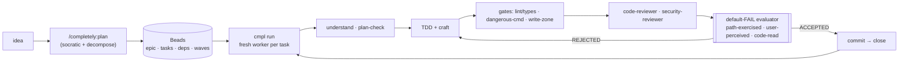

# completely

[](https://github.com/23ag1/completely)
[](plugin/tests/contracts.sh)
[](LICENSE)
[](https://github.com/23ag1/completely/stargazers)
[](https://github.com/steveyegge/beads)

**A quality-first harness for autonomous AI coding agents.**
It turns *"the agent said it's done"* into *"here's the proof — graded by an independent,
default-FAIL checker."* **Done is earned, not asserted.**

`completely` is the governance layer over your **Claude Code** agent: deterministic gates that can't
be skipped, a **default-FAIL evaluator** in the close path of the loop, and a **Beads task spine** so
there's one source of truth — not three. Short CLI: **`cmpl`**. Slash commands: **`/completely:*`**.

> **It holds *itself* to the same bar.** This repo is built through its own engine; every
> deterministic contract is in `cmpl test` (**77 passing**); and during its own development its
> default-FAIL evaluator caught a real over-graded task — and its loop caught a flagship crash that
> shipped with a fully green test suite — *before* they could land.

---

## ⚡ Quickstart (30 seconds)

```bash
# 1. install the plugin
claude plugin marketplace add 23ag1/completely
claude plugin install completely@completely

# 2. in any repo — plan a feature straight into Beads, then let the engine drive it
/completely:plan        # discovery → decompose → land an epic + tasks + dependency waves in Beads
cmpl run --dry-run      # preview the queue + the parallel plan
cmpl auto               # run it: a fresh worker per task, gated, graded, committed, closed
```

The only hard dependency is **Beads** (`bd`). Everything else is optional. `cmpl setup` reports
what's missing; `cmpl setup --install` installs it (with consent). Full install notes
[below](#install).

---

## The problem this solves

Autonomous coding agents fail in the same boring ways, and a longer `CLAUDE.md` doesn't fix it
(an essay nobody executes):

- claim **"done"** without actually running anything;
- quietly **downscope** a tool into a stub, or **disable a failing test** to go green;
- ship code that **passes the tests but is wrong** — green suite, broken behaviour;
- **close a task with the code uncommitted**, or **lose context / get killed** mid-task;
- you stack a planner + a loop + a task tracker and they **fight** — three queues, drift, no truth.

`completely` fixes these **structurally** — by engineering the environment so they can't happen —
instead of asking nicely in a prompt.

## How it works

One pipeline, the same for every task. Plans land in Beads; a fresh-context worker runs the full
engine per task; nothing closes until an independent grader passes it on evidence.



The agent never grades its own homework: the **evaluator is a separate read-only process** that
returns **FAIL unless evidence proves pass** — *no evidence = no pass.* And the loop **never lies
about "done"**: it reports `DONE` only when the queue is empty, there are zero orphaned tasks, the
tree is clean, **and the union of the batch actually composes**.

## What you get (one install)

- **Spine — [Beads](https://github.com/steveyegge/beads).** Status, memory (comments/decisions/ADRs),
  and coordination live in one queue. *Status never lives in markdown.*
- **Planning — GSD depth, Beads-first.** Socratic discovery → decompose → goal-backward self-check.
  Plans land **straight into Beads** as an epic + worker-contract tasks + dependency **waves** +
  `must_haves` + `read_context`. No `PLAN.md` to drift out of sync.
- **Execution — one engine, two modes.** **control** (supervised, human gates) or **auto**
  (unattended, fresh `claude -p` per task over `bd ready`). **Parallel by default**: tasks with
  *disjoint* write-zones run concurrently; same-file ones serialize.
- **The quality floor (deterministic, exit-2 hooks):**
  - lint + types on **every edit**; `cmpl check` runs all checks in **one terse pass**;
  - **dangerous-command** block (`rm -rf`, force-push…);
  - **commit-before-close** — `bd close` refused while the tree is dirty;
  - **edit-time write-zone fence** — a worker can't write outside its declared files;
  - **binding reviewer findings** — can't close over an unresolved CRITICAL/HIGH.
- **The grader — a default-FAIL `evaluator`.** Every acceptance criterion starts FAIL and only flips
  with evidence the grader re-ran itself. It checks four ways the work can be fake:
  - **Path-Exercised** — the *real* runtime path ran, not a mock/`--dry-run` (with a negative control);
  - **User-Perceived** — exercised *as a user* (run the command / hit the endpoint / screenshot) — no run = FAIL;
  - **Code-Read** — the grader *reads the diff* and re-derives correctness (off-by-ones, swallowed errors, fail-open defaults) independent of the reviewer;
  - plus a **no-stub / no-downscope** contract (`cmpl lint`) and an **adversarial** claim-vs-refute mode.
- **Enforced at spawn, not just documented.** Thinking-models (plan-check), security review,
  project-wide review fit, path-exercised, user-perceived, and code-read are **injected into the
  worker's prompt** — it can't no-op past them by "not reading the doc."
- **Reliable unattended.** Activity-based stall detection (a busy worker is never false-killed),
  `worker_id` + heartbeat **orphan recovery** (a session that dies mid-task is auto-reopened on the
  next run — see `cmpl orphans` / `cmpl status`), an **integration gate** after each parallel batch,
  and a **run-report** that never reports a half-done run as finished.
- **Adaptive & upgrade-safe.** Frontend **and** backend in one system, detected automatically;
  overlays mean it never edits your GSD install; `cmpl doctor` quarantines on upstream drift.

## How it compares (honest)

`completely` is **not** an agent and **not** a SWE-bench entry — it's the harness that makes the agent
you already have (Claude Code) *trustworthy*. The category's real unsolved problem is **verification**;
this is the only layer that puts an independent, default-FAIL grader **in the close path of an
autonomous loop**.

| | Raw Claude Code | Ralph loop | GSD | Beads (alone) | Broad agents¹ | **completely** |
|---|:---:|:---:|:---:|:---:|:---:|:---:|
| Autonomous loop | ✗ interactive | ✓ fresh-context | partial (waves) | ✗ | ✓ | ✓ **+ parallel** |
| **Independent "done" check** | ✗ self-reported | ✗ trusts exit-signal | reviewer agents | ✗ | ✗ / self-eval | ✓ **default-FAIL evaluator** in close path |
| Deterministic gate hooks | ✗ | ✗ | ✗ | ✗ | ✗ | ✓ exit-2 |
| No-stub / no-downscope contract | ✗ | ✗ | ✗ | ✗ | ✗ | ✓ `cmpl lint` |
| Single task spine | ✗ chat | a PRD file | md todos | ✓ *(is Beads)* | tool-specific | ✓ Beads — one queue |
| Planning depth | ✗ | assumes a plan | ✓ *(its strength)* | ✗ | varies | ✓ **GSD**, landed in Beads |
| **What it is** | the agent | a loop | a planner | the spine | full agents | **the quality harness over all of them** |

¹ Aider · OpenHands · Devin — full agents/platforms with their own strengths (benchmarks, breadth).
`completely` complements rather than competes: bring your agent, it makes the output trustworthy. It
**unifies** GSD and Beads — they're allies it routes between, not rivals.

## Command surface

`cmpl` (short CLI) · slash equivalents `/completely:*`:

| Command | Does |
|---|---|
| `cmpl auto` | run **autonomously** — fresh `claude -p` per task over `bd ready` until empty |
| `cmpl control` | run **supervised** — the single next task, every step shown, pausing at human gates |
| `cmpl run` | generic driver (`--dry-run` previews the parallel plan; `auto`/`control` are aliases) |
| `cmpl status` | read-only loop-health snapshot — running? counts, orphans, dirty tree, verdict |
| `cmpl orphans [--reap]` | list (or reopen) tasks a dead/interrupted run left claimed |
| `cmpl check` | run all configured checks (lint/types/tests), one pass, terse output |
| `cmpl lint` | enforce the worker-contract (acceptance + design + write-zone + verify) on Beads tasks |
| `cmpl plan-apply` | materialize a structured plan → Beads epic + tasks + waves (the Beads-first path) |
| `cmpl craft [path]` | detect stack/domain → route to the right reviewers, test runner, craft skills |
| `cmpl bench` | measure quality/$ **with vs without** completely (arms × repeats) |
| `cmpl quality` | scaffold a pre-commit gate (`cmpl check`) + starter lint configs |
| `cmpl doctor` | upstream version drift + overlay quarantine (exit 1 on drift) |
| `cmpl test` | run the contract regression suite (77 passing) |
| `cmpl setup` | report deps; `--install` installs missing ones via their real channels |
| `cmpl emit` / `cmpl sync` | *migration:* import an existing GSD `PLAN.md` / markdown task list → Beads |

## Install

```bash
claude plugin marketplace add 23ag1/completely
claude plugin install completely@completely
```

| Dependency | Required? | Install |
|---|---|---|
| **Beads** (`bd`) | **yes** — the spine | `npm i -g @beads/bd` · `brew install beads` |
| GSD | optional — planning depth | `npx get-shit-done-cc --global` |
| claude-mem | optional — cross-session memory | `claude plugin install claude-mem@thedotmack` |

On install a Setup hook reports what's missing. `cmpl setup --install` installs it (add `--dry-run`
to preview the exact commands). **Manual / non-plugin:**
`git clone https://github.com/23ag1/completely && cd completely && ./install.sh --project /path/to/repo`.

## FAQ

**Isn't this just a wrapper around Claude Code?**
No. It adds three things Claude Code doesn't have: deterministic gate *hooks* (they exit non-zero,
the agent can't talk past them), an **independent** default-FAIL evaluator process (the agent can't
grade its own work), and a Beads task spine (one queue instead of chat history).

**How is it different from the Ralph loop?**
Ralph trusts the agent's self-reported "I'm done." completely's loop closes a task **only** when a
separate read-only evaluator passes it on evidence — and reports `DONE` only when the tree is clean
with no orphans and the batch's union composes.

**Do I have to give up GSD or Beads?**
No — it *unifies* them. GSD plans land as Beads epics; you get one queue, not three.

**What does "default-FAIL" actually mean?**
The grader returns FAIL for every criterion unless it has direct, reproducible evidence (output it
re-ran, a real-path test, the diff it read). No evidence = no pass. That's the whole brand.

**Is the autonomy real or a diagram?**
Real — a fresh `claude -p` worker per task. This repository was built by it, and survives session
limits / crashes via heartbeat-based orphan recovery.

**What's the one hard dependency?**
Beads (`bd`). GSD and claude-mem are optional.

## Configure

A `completely.toml` (optional — sane defaults) tunes the pipeline without touching scripts:
`[stack]`, `[architecture]`, `[check].commands`, `[skills].prefer`, `[tools].lazy`. Your own skills
and rules compose **on top** — completely layers, it never overrides. Knobs:
`CMP_PARALLEL` (worker concurrency, default 4) · `CMP_ALLOW_DIRTY_CLOSE` ·
`CMP_HEARTBEAT_STALE` · `CMP_INTEGRATION_CMD` · `CMP_PUSH`.

See [`plugin/core/`](plugin/core/) for the principle, roles, routing, the task engine, the
architecture presets, and token-economy; [`docs/TOOL-COMPATIBILITY.md`](docs/TOOL-COMPATIBILITY.md)
for the full design.

## Caveats (honest)

- **Token cost.** Multi-agent verification costs multiples of a single session — keep a fast path for
  trivial edits. A published `quality/$` figure (`cmpl bench`) is on the roadmap.
- **Unattended needs an active session.** Nested workers progress while the launching session is
  active; run `cmpl auto` in the foreground. Interrupted runs auto-recover orphans on the next start.
- **The grader is only as good as the evidence.** Its value is *structural* (it can't be skipped),
  not magic.
- **Trust** — install skills/MCP only from sources you trust.

## Contributing

Issues and PRs welcome. The contract suite (`cmpl test`) is the spec — keep it green; new behaviour
ships with a contract. The harness is built through its own engine, so `core/task-engine.md` is both
the design doc and the way to contribute.

## License

MIT — see [`LICENSE`](LICENSE).
